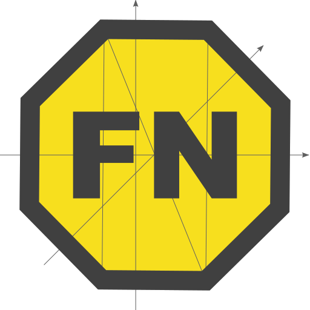

# FN

fun fun fun

A small utility library for dealing with functions

## Examples

### K

```javascript
const konst = K('this is the value', 'following args are ignored');

console.log(
  konst.name,                  // K(this is the value)
  konst.toString(),            // () => $
  konst(),                     // this is the value
  konst('different value'),    // this is the value
);
```

### ident

```javascript
const a = [0, 1, 2, 3, 4];

console.log(
  a.map(ident),                     // [ 0, 1, 2, 3, 4 ]
  a.filter(ident),                  // [ 1, 2, 3, 4 ]
);


const b = [Symbol(1), Symbol(2)];
const c = b.map(ident);

console.log(
  b.map((_, i) => b[i] === c[i]),  // [ true, true ]
);
```

### pipe and compose

```javascript
const plus10 = $ => $ + 10;
const times2 = $ => $ * 2;


const plusBeforeTimes = pipe(plus10, times2);       // ($ + 10) * 2
const plusAfterTimes = compose(plus10, times2);     // ($ * 2) + 10

console.log(
  plusBeforeTimes.name,                             // pipe(plus10,times2)
  plusAfterTimes.name,                              // compose(plus10,times2)
);

console.log(
  plusBeforeTimes(1),                               // 22
  plusAfterTimes(1),                                // 12
);
```

### tie

```javascript
const tie = FN.tie;


const a = (one, two, three) => one + two + three;
const b = function c(...$$) {
  console.log('args provided:', ...$$);
  return $$;
};

class D {
}

const f = tie(a, 1);
const g = tie(b, 'first', Symbol('second'));
const h = tie(f, 2);

const C = tie(D, 1, 2, 3);

console.log(
  f.name,     // a(1)
  g.name,     // c(first,Symbol(second))
  h.name,     // a(1)(2)
  C.name,     // D(1,2,3)
);

console.log(
  f(3),        // NaN
  h(3),        // 6
  new C(),     // D {}
);

g();            // args provided: first Symbol(second)
```
