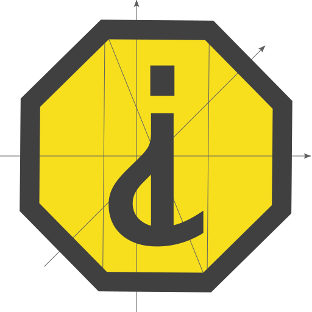

# IS

it?

A small utility library for checking values

## Examples

```javascript
console.log(
  IS.fun($ => $),                 // true
  IS.fun(),                       // false

  IS.nan(NaN),                    // true

  IS.int(1),                      // true
  IS.integer(1),                  // true
  IS.num.int(1),                  // true

  IS.array([]),                   // true
  IS.ar([]),                      // true
  IS.ar.empty([]),                // true
  IS.array.empty(),               // false

  IS.empty(''),                   // true
  IS.empty([]),                   // true
  IS.empty({}),                   // true
  IS.empty(null),                 // true

  IS.primitive('yes'),            // true
  IS.primitive(new String('no')), // false
);
```
